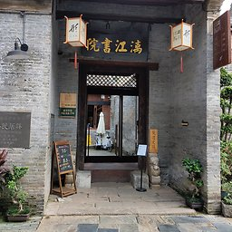
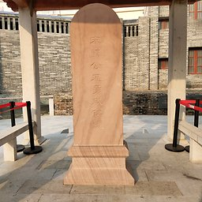

== 朝阳商圈

=== 小嘟来食街（南宁饭店）

[options="header,footer"]
|===================================================
|营业时间                       |电话        |地址                                                                                                   |公交                 |地铁
|午餐11:00-14:00 晚餐17:00-22:00|0771-2103980|https://foursquare.com/v/%E5%B0%8F%E5%98%9F%E6%9D%A5%E9%A3%9F%E8%A1%97/4ba5d1e9f964a5200c2439e3[兴宁区民生路38号南宁饭店锦绣楼二层]|8、78、87路 朝阳广场站|http://www.nngdjt.com/html/service1c/[1号线、2号线 朝阳广场站]
|===================================================

推荐食街的https://zh.wikipedia.org/zh-cn/%E5%85%AB%E5%AE%9D%E9%A5%AD[八宝饭]（15元）、牛肉卷筒粉（10元）、煎粽（25元）、老友面（12元）、蕉叶糍（12元）、炒田螺（25元）、粉饺（12元）。

.八宝饭

.牛肉卷筒粉
image::thumbs/juantongfen.jpg["牛肉卷筒粉", width=256,link="images/juantongfen.jpg"]

.煎粽
image::thumbs/jianzong.jpg["煎粽", width=256,link="images/jianzong.jpg"]

.老友面

.蕉叶糍

.炒田螺
image::thumbs/chaotianluo.jpg["炒田螺", width=256,link="images/chaotianluo.jpg"]

.粉饺
image::thumbs/fenjiao.jpg["粉饺", width=256,link="images/fenjiao.jpg"]

=== 广西高等法院办公楼旧址（南宁建制博物馆）

[options="header,footer"]
|==================================================================================================================
|开放时间             |地址            |公交                                                   |地铁
|周二至周日 9:00-17:00|https://foursquare.com/v/%E5%B9%BF%E8%A5%BF%E9%AB%98%E7%AD%89%E6%B3%95%E9%99%A2%E5%8A%9E%E5%85%AC%E6%A5%BC%E6%97%A7%E5%9D%80/4fdc3e626d86497ef94b70da[兴宁区朝阳路3-5号]|207、604、706、34、45、76、79、205、B10路 民族江北路口站|http://www.nngdjt.com/html/service1c/[1号线、2号线 朝阳广场站]
|==================================================================================================================

参观免费。每天10:00和15:00两次为参观者免费讲解。

明清时期曾是南宁府署。
辛亥革命后广西高等审判厅在此办公。
1927年改为广西高等法院。
1950年南宁市政府在此办公。

.南宁建制博物馆
image::thumbs/nanningjianzhibowuguan.jpg["南宁建制博物馆", width=256,link="images/nanningjianzhibowuguan.jpg"]

=== 邓颖超纪念馆

[options="header,footer"]
|============================================================================================================
|开放时间             |地址       |公交                                                   |地铁
|周二至周日 9:00-16:30|https://foursquare.com/v/%E9%82%93%E9%A2%96%E8%B6%85%E7%BA%AA%E5%BF%B5%E9%A6%86/4d5795bbd1a08cfa5b0d05ba[民族大道37号]|207、604、706、34、45、76、79、205、B10路 民族江北路口站|http://www.nngdjt.com/html/service1c/[1号线、2号线 朝阳广场站]
|============================================================================================================

免票入场（入场需要刷身份证）。法定节假日超常开放。
有讲解服务（100元/次）。时长45分钟。

.邓颖超纪念馆
image::thumbs/dengyingchaojinianguan.jpg["邓颖超纪念馆", width=256,link="images/dengyingchaojinianguan.jpg"]

=== 金狮巷民居群

[options="header,footer"]
|======================================================================================================================================
|开放时间|地址                                               |公交                                                  |地铁
|  ???    |https://foursquare.com/v/%E9%87%91%E7%8B%AE%E5%B7%B7%E6%B0%91%E5%B1%85%E7%BE%A4/503deb9be8893e93b7796823[兴宁路西二里50、52、54、56、58、60、62、64、66、68号]|207、604、706、34、45、76、79、205、B10路 民族江北路口站|http://www.nngdjt.com/html/service1c/[1号线、2号线 朝阳广场站]
|======================================================================================================================================

.金狮巷民居群

=== 邕州知州苏缄殉难遗址

[options="header,footer"]
|=======================================================================================================
|开放时间  |地址             |公交                                                   |地铁
|0:00-24:00|https://foursquare.com/v/%E9%82%95%E5%B7%9E%E7%9F%A5%E5%B7%9E%E8%8B%8F%E7%BC%84%E6%AE%89%E9%9A%BE%E9%81%97%E5%9D%80/4fd847b9003937c4499af2eb[兴宁区兴宁路西二里]|207、604、706、34、45、76、79、205、B10路 民族江北路口站|http://www.nngdjt.com/html/service1c/[1号线、2号线 朝阳广场站]
|=======================================================================================================

北宋年间，在邕城的知州 https://zh.wikipedia.org/zh-cn/%E8%8B%8F%E7%BC%84[苏缄]为了抵抗越南军的入侵，坚守邕城。
最后城破，苏缄带领全家三十六人引火自焚，以身殉国。

.邕州知州苏缄殉难遗址

=== 新华路水塔

[options="header,footer"]
|=========================================================================================================
|开放时间  |地址            |公交                                                      |地铁
|0:00-24:00|https://foursquare.com/v/%E6%96%B0%E5%8D%8E%E8%A1%97%E6%B0%B4%E5%A1%94/4fd8450d003937c4499a87b7[兴宁区新华路南段]|34、35、45、46、76、79、205、207、604、701、706路 民生广场站|http://www.nngdjt.com/html/service1c/[1号线、2号线 朝阳广场站]
|=========================================================================================================

1934年由广西省政府兴建。广东谦德公司承建。1937年开始供水。
水泵、水塔等器材均从德国 https://zh.wikipedia.org/zh-cn/%E8%A5%BF%E9%97%A8%E5%AD%90%E5%85%AC%E5%8F%B8[西门子洋行]购买。
曾经是南宁市的最高建筑。据传日军占领南宁时，曾在塔顶插上https://zh.wikipedia.org/zh-cn/%E6%97%A5%E6%9C%AC%E5%9B%BD%E6%97%97[日章旗]。

现已停止供水。

.新华路水塔
image::thumbs/xinhualushuita.jpg["新华路水塔", width=256,link="images/xinhualushuita.jpg"]

=== 西关路铁桥

[options="header,footer"]
|===================================================================================================
|开放时间  |地址            |公交                                                |地铁
|全天开放|https://foursquare.com/v/%E8%A5%BF%E5%85%B3%E8%B7%AF%E9%93%81%E6%A1%A5/4fd8aa55c2ee1b7347495ebb[兴宁区西关路北段]|18、40、58、78、202、203、B3、B5、B57路 人民朝阳路口站|http://www.nngdjt.com/html/service1c/[1号线、2号线 朝阳广场站]
|===================================================================================================

为南宁市第一座铁桥。
民国时期，西关路一带曾为妓院所在。当时政府为了方便通往“特察里”，为了交通方便，于是造了这座桥。

由德国人设计，广东谦德公司承建。
南北走向的三拱人行拱桥。钢架结构，钢筋混凝土桥面，混凝土台墩。现仍在使用。

.西关路铁桥

